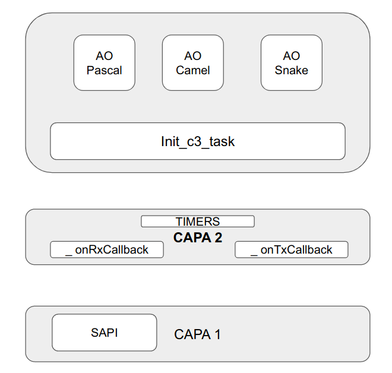

<h2>
    Proyecto grupal para la materia: 
    Sistemas Operativos en Tiempo Real II"
</h2>
=======================================================

## Grupo 3

### Integrantes:
<ul>
 <li>Matias Gino Meghinasso</li>
 <li>Federico Nicolas Meghinasso</li>
 <li>German Gabriel Velardez</li>
</ul>

### Justificaciones

Para disminuir la fragmentación de memoria al minimo, se va a utilizar:

<ul>
 <li>Memory pools</li>
 <li>Implementación de memoria dinámica "heap4.c"</li>
</ul>

Además, los pools de memoria ofrecen una asignación y un reciclaje rápido y determinista de los bloques.

### Segunda semana:
Se modifico lo siguiente:
<ul>
 <li> Archivos (.h,.c) gp se renombraron como protocol</li>
 <li>Se modificaron las implementaciones tanto de ISR como de iniciación del modulo protocol.</li>
</ul>

Se agrego lo siguiente:
<ul>
 <li>Funciones de pool de memorias</li>
 <li>Funciones de comprobacion de CRC8,formato y secuencia valida.</li>
 <li>Se agrego modulo de capa 3 (m_c3.h, m_c3.c) donde se gestionan las tareas de esta capas.</li>
 
</ul>

### Tercera semana:
Se modifico lo siguiente:
<ul>
 <li> Se desarrollo driver.c para reemplazar a protocol.c</li>
 <li> m_c3.c ya no se utiliza</li>
 <li>Se modificaron las implementaciones tanto de ISR como de iniciación del modulo protocol.</li>
 <li>Se agregaron los archivos msg_format(.h,.c) donde se implementan las funciones para cambiar de formato los string de texto</li>
 <li>Se agrego diagrama de sistema </li>
 <li>Se implementa timmers tanto para recepccion como para transmisión </li>
 <li>Se completo las funciones para checkeo de formato valido del mensaje, secuencia y crc</li>
 <li>Se implemento la transmisión de mensaje mediante interrupcion </li>

</ul>
    
    
### Cuarta semana:
Se modifico lo siguiente:
<ul>
 <li> Se agrego el archivo error_msg.c</li>
 <li> Se implemento agregar mensaje de error al final de block con formato invalido</li>
 <li> Se implemento funcion para comprobar numero de palabras maximo y minimo en mensaje validos</li>
 <li> Se soluciono problemas con las funciones de cambio de formato de mensajes</li>
   

</ul>

### Quinta semana: Implementacion de objeto Activo.
     
     
     Se modifico lo siguiente:
<ul>
	 <li> Se implemento 5 objetos activos, 3 de formato y 2 de errores</li>
	 <li> Las tareas se crean y se destruyen de manera dinamica</li>
	 <li> Se modifico el driver_task para transformarlo en el event_dispacher</li>
	 <li> Se agrega diagrama del sistema con la implementacion de objetos activos</li>
</ul>
 
 
 
### Semana Final: Correciones finales.
     
     
     Se modifico lo siguiente:
<ul>
	 <li>Se elimino el objeto activo para los errores</li>
	 <li>Se modifico el diagrada del sistema </li>
         <li>Se formateo el codigo para simplificar la lectura, comprension  y  mantenimiento del mismo </li>
	 <li>Se agrego TaskHandler a los objetos activos</li>
	 <li> Se separo las responsabilidades de las capas</li>
	 <li> Se resolvio error de cerrar bloques de datos con RX timeout</li>
</ul>
 

<h4 style="text-align:center;">
    Diagrama final del sistema
</h4>
=======================================================
<figure style="float: center">
  
  
</figure>

